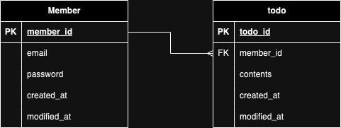

# wanted-pre-onboarding-backend

원티드 프리온보딩 백엔드 인턴십 - 선발 과제

## 지원자의 성명

정지운

## 애플리케이션의 실행 방법 (엔드포인트 호출 방법 포함)

#### 실행 명령어

**필요 사항**

1. mySQL 설치 (`todolist` 데이터베이스 생성)
2. node version 18 설치

아래의 명령어 입력하기 전에 `.env` 파일을 생성합니다.
해당 파일에 작성해야하는 변수는 `.env.example`을 참고하여 작성해주세요.

```bash
$ npm install
$ npm run start
```

#### 엔드포인트 호출 방법

API Document: #

## 데이터베이스 테이블 구조



## 구현한 API의 동작을 촬영한 데모 영상 링크

#### 회원가입

#### 로그인

#### Todo

## 구현 방법 및 이유에 대한 간략한 설명

## API 명세(request/response 포함)
